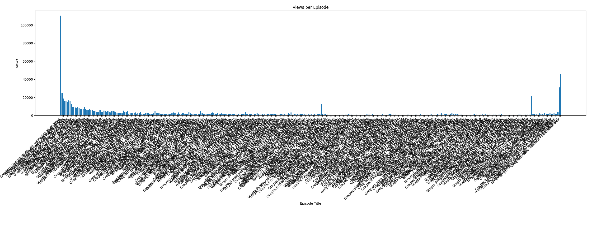
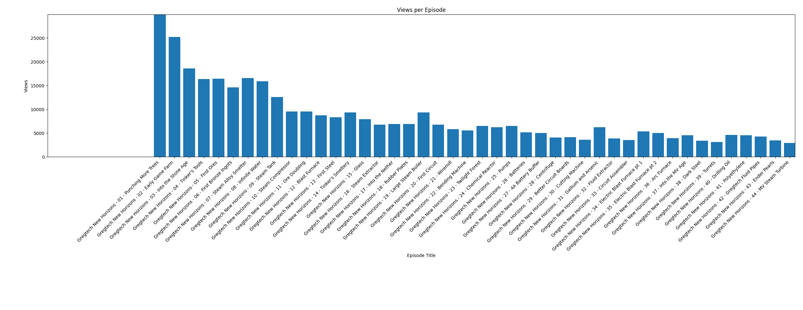
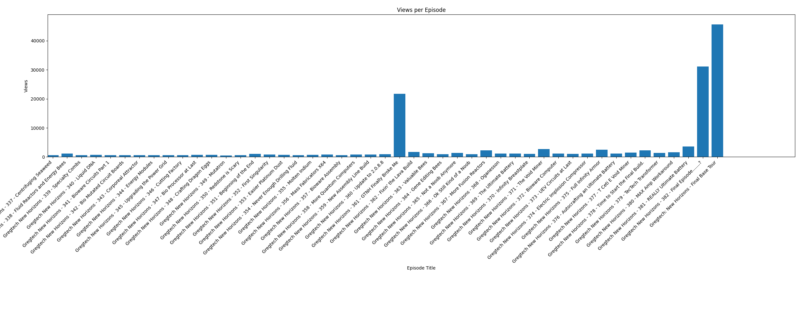
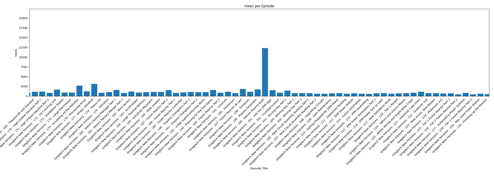

# [Minecraft - Gregtech New Horizons by Kharax82](https://www.youtube.com/playlist?list=PLliiJ70rl2NvJjby2LoVuP1EuOvRAyf97) view stats 2024-11-23
The point is to show that only a fraction of ppl who start a series actually watch every ep (especially at near the end):



We can see a spike at the beginnig (although out of 100k only a quarter of ppl make to second video):



a spike at the end (final base tour)
and a spike at a critical narrative point ("GTNH 
nearly broke me" video, which sparked a new wave of interest):



also a spike at "helium plasma build" video:



The rest of data actually shows a gradual dwindling of views,
as series progress, only hardcore fans are watching each ep (or those who have the series in background).

## Views per episode:

```
                                                             title  views
                  Gregtech New Horizons - 01 - Punching More Trees 110514
                      Gregtech New Horizons - 02 - Early Game Farm  25225
                   Gregtech New Horizons - 03 - Into the Stone Age  18577
                       Gregtech New Horizons - 04 - Tinker's Tools  16399
                           Gregtech New Horizons - 05 - First Ores  16414
                  Gregtech New Horizons - 06 - First Bronze Ingots  14642
                  Gregtech New Horizons - 07 - Steam Alloy Smelter  16561
                       Gregtech New Horizons - 08 - Infinite Water  15897
                           Gregtech New Horizons - 09 - Steam Tank  12620
                     Gregtech New Horizons - 10 - Steam Compressor   9568
                         Gregtech New Horizons - 11 - Ore Doubling   9524
                        Gregtech New Horizons - 12 - Blast Furnace   8762
                          Gregtech New Horizons - 13 - First Steel   8322
                    Gregtech New Horizons - 14 - Tinker's Smeltery   9349
                                Gregtech New Horizons - 15 - Glass   7941
                      Gregtech New Horizons - 16 - Steam Extractor   6764
                      Gregtech New Horizons - 17 - Into the Nether   6920
                        Gregtech New Horizons - 18 - Rubber Plates   6951
                   Gregtech New Horizons - 19 - Large Steam Boiler   9342
                        Gregtech New Horizons - 20 - First Circuit   6814
                             Gregtech New Horizons - 21 - Wiremill   5863
                      Gregtech New Horizons - 22 - Bending Machine   5563
                      Gregtech New Horizons - 23 - Twilight Forest   6529
                     Gregtech New Horizons - 24 - Chemical Reactor   6275
                                Gregtech New Horizons - 25 - Pumps   6485
                            Gregtech New Horizons - 26 - Batteries   5176
                    Gregtech New Horizons - 27 - 4A Battery Buffer   5016
                           Gregtech New Horizons - 28 - Centrifuge   4100
                Gregtech New Horizons - 29 - Better Circuit Boards   4116
                      Gregtech New Horizons - 30 - Cutting Machine   3625
                  Gregtech New Horizons - 31 - Gallium and Arsenic   6272
                      Gregtech New Horizons - 32 - Fluid Extractor   3878
                    Gregtech New Horizons - 33 - Circuit Assembler   3574
          Gregtech New Horizons - 34 - Electric Blast Furnace pt 1   5352
          Gregtech New Horizons - 35 - Electric Blast Furnace pt 2   5050
                          Gregtech New Horizons - 36 - Arc Furnace   3945
                      Gregtech New Horizons - 37 - Into the MV Age   4564
                           Gregtech New Horizons - 38 - Dark Steel   3425
                              Gregtech New Horizons - 39 - Turrets   3160
                         Gregtech New Horizons - 40 - Drilling Oil   4650
                         Gregtech New Horizons - 41 - Polyethylene   4578
                 Gregtech New Horizons - 42 - Gregtech Fluid Pipes   4308
                         Gregtech New Horizons - 43 - Ender Pearls   3448
                     Gregtech New Horizons - 44 - MV Steam Turbine   2908
                 Gregtech New Horizons - 45 - Better Circuit Parts   2424
                    Gregtech New Horizons - 46 - Upgrading the EBF   2964
                      Gregtech New Horizons - 47 - Stainless Steel   2789
                          Gregtech New Horizons - 48 - Naga Scales   2217
                  Gregtech New Horizons - 49 - Starting Thaumcraft   5465
                              Gregtech New Horizons - 50 - Brewery   3887
             Gregtech New Horizons - 51 - Bronze Boiler Multiblock   3622
                Gregtech New Horizons - 52 - Charcoal Pile Igniter   4638
                    Gregtech New Horizons - 53 - Advanced Circuits   2035
                        Gregtech New Horizons - 54 - Chemical Bath   2220
                    Gregtech New Horizons - 55 - Portable Scanning   2472
              Gregtech New Horizons - 56 - Railcraft Blast Furnace   2204
                  Gregtech New Horizons - 57 - Charcoal Automation   2531
                      Gregtech New Horizons - 58 - Farming Station   3249
            Gregtech New Horizons - 59 - Etching MV Circuit Boards   2066
                          Gregtech New Horizons - 60 - Diesel Fuel   2892
                  Gregtech New Horizons - 61 - Prospecting for Oil   2436
                     Gregtech New Horizons - 62 - Oil Drilling Rig   4020
               Gregtech New Horizons - 63 - Plastic Circuit Boards   1931
                       Gregtech New Horizons - 64 - SMD Capacitors   1699
                        Gregtech New Horizons - 65 - Twilight Lich   1927
                     Gregtech New Horizons - 66 - Cleanroom Part 1   2468
                     Gregtech New Horizons - 67 - Cleanroom Part 2   2549
                         Gregtech New Horizons - 68 - HV Generator   2454
                       Gregtech New Horizons - 69 - HV Progression   1759
                       Gregtech New Horizons - 70 - Vacuum Freezer   2017
                         Gregtech New Horizons - 71 - HV Macerator   1563
              Gregtech New Horizons - 72 - Starting the Space Race   2313
                          Gregtech New Horizons - 73 - Auto Mining   4503
                   Gregtech New Horizons - 74 - Killing the Wither   2352
               Gregtech New Horizons - 75 - Thaumcraft Progression   2934
                       Gregtech New Horizons - 76 - Infusion Altar   2211
                     Gregtech New Horizons - 77 - Automated Golems   1994
                      Gregtech New Horizons - 78 - Nichrome Ingots   1612
                               Gregtech New Horizons - 79 - Teflon   1723
                  Gregtech New Horizons - 80 - Dire Crafting Table   1887
                 Gregtech New Horizons - 81 - Implosion Compressor   1855
                       Gregtech New Horizons - 82 - Nanosuit Armor   1997
                  Gregtech New Horizons - 83 - Galacticraft Part 1   2028
                  Gregtech New Horizons - 84 - Galacticraft Part 2   1415
                       Gregtech New Horizons - 85 - Industrial TNT   1361
                        Gregtech New Horizons - 86 - Tier 1 Rocket   2093
                         Gregtech New Horizons - 87 - Moon Landing   3338
                             Gregtech New Horizons - 88 - Titanium   2149
                        Gregtech New Horizons - 89 - Space Station   2776
                         Gregtech New Horizons - 90 - Moon Dungeon   1819
           Gregtech New Horizons - 91 - Applied Energistics Part 1   3377
           Gregtech New Horizons - 92 - Applied Energistics Part 2   2011
             Gregtech New Horizons - 93 - Upgrading Oil Production   1835
               Gregtech New Horizons - 94 - Large Chemical Reactor   2843
                         Gregtech New Horizons - 95 - Autocrafting   2279
                      Gregtech New Horizons - 96 - Into the EV Age   1823
                       Gregtech New Horizons - 97 - Digital Fluids   1585
                        Gregtech New Horizons - 98 - Tungstensteel   1724
                  Gregtech New Horizons - 99 - Large Steam Turbine   3682
                Gregtech New Horizons - 100 - Epoxy Circuit Boards   2317
                  Gregtech New Horizons - 101 - Epoxy Resin sheets   1468
                         Gregtech New Horizons - 102 - P2P Network   1516
                     Gregtech New Horizons - 103 - Landing on Mars   1556
                      Gregtech New Horizons - 104 - Exploring Mars   1394
                               Gregtech New Horizons - 105 - Radon   1406
                       Gregtech New Horizons - 106 - Nanoprocessor   1179
               Gregtech New Horizons - 107 - Cetane Boosted Diesel   1776
                     Gregtech New Horizons - 108 - Nuclear Reactor   4508
                  Gregtech New Horizons - 109 - Distillation Tower   2227
          Gregtech New Horizons - 110 - Alloy Blast Smelter Part 1   1345
          Gregtech New Horizons - 111 - Alloy Blast Smelter Part 2   1116
                   Gregtech New Horizons - 112 - Drilling for Salt   1564
            Gregtech New Horizons - 113 - Diesel Combustion Engine   1881
                          Gregtech New Horizons - 114 - UUA Matter   1445
                     Gregtech New Horizons - 115 - Mass Fabricator   1239
                    Gregtech New Horizons - 116 - Forestry Farming   2941
                       Gregtech New Horizons - 117 - Starting Bees   3317
                        Gregtech New Horizons - 118 - Bee Breeding   2390
                 Gregtech New Horizons - 119 - Industrial Extruder   1471
                Gregtech New Horizons - 120 - Redesigning the Base   2018
     Gregtech New Horizons - 121 - Power Station Multiblock Part 1   2582
     Gregtech New Horizons - 122 - Power Station Multiblock Part 2   1623
                 Gregtech New Horizons - 123 - Wireless AE Network   1129
              Gregtech New Horizons - 124 - Gas Turbine Multiblock   2295
               Gregtech New Horizons - 125 - Platinum Group Sludge   1372
                       Gregtech New Horizons - 126 - Tier 3 Rocket   1213
                    Gregtech New Horizons - 127 - Landing on Ceres   1241
                    Gregtech New Horizons - 128 - Ore Drilling Rig   1946
                       Gregtech New Horizons - 129 - Naquadah Fuel   1440
                              Gregtech New Horizons - 130 - Indium   1158
                  Gregtech New Horizons - 131 - IV Age Progression   1290
         Gregtech New Horizons - 132 - Upgrading the Power Station   1137
                 Gregtech New Horizons - 133 - IV Power Generation   1940
             Gregtech New Horizons - 134 - Quantum Circuits Part 1   1105
             Gregtech New Horizons - 135 - Quantum Circuits Part 2    999
                            Gregtech New Horizons - 136 - Ur-Ghast   1019
                         Gregtech New Horizons - 137 - Ender Tanks   1477
             Gregtech New Horizons - 138 - ZPM Circuit Preparation   1018
                    Gregtech New Horizons - 139 - Enderman Mobfarm   1871
           Gregtech New Horizons - 140 - Industrial Material Press   1113
                Gregtech New Horizons - 141 - Assembly Line Part 1   1547
            Gregtech New Horizons - 142 - Automated Ore Processing   3417
            Gregtech New Horizons - 143 - Large Processing Factory   1784
                       Gregtech New Horizons - 144 - Base Upgrades   1311
                   Gregtech New Horizons - 145 - Quad Cell Reactor   1129
               Gregtech New Horizons - 146 - Molecular Transformer   1044
           Gregtech New Horizons - 147 - Argon and Naquadah Boules   1219
                          Gregtech New Horizons - 148 - PBI sheets    997
                    Gregtech New Horizons - 149 - Naquadah Reactor   1679
            Gregtech New Horizons - 150 - Large Sifting Multiblock   1934
                        Gregtech New Horizons - 151 - Ender Dragon   2173
                 Gregtech New Horizons - 152 - Adventure Backpacks   1336
                Gregtech New Horizons - 153 - Assembly Line Part 2    908
                Gregtech New Horizons - 154 - Assembly Line Part 3    967
                   Gregtech New Horizons - 155 - Into the LuV Age!   1089
                      Gregtech New Horizons - 156 - LuV components    913
                 Gregtech New Horizons - 157 - Electric Prospector   1719
                       Gregtech New Horizons - 158 - Tier 4 Rocket    996
                               Gregtech New Horizons - 159 - Venus   1113
                 Gregtech New Horizons - 160 - Upgrading Power Gen   1144
         Gregtech New Horizons - 161 - Large Heat Exchanger Part 1   1533
         Gregtech New Horizons - 162 - Large Heat Exchanger Part 2   1224
         Gregtech New Horizons - 163 - Large Centrifuge Multiblock   1130
                        Gregtech New Horizons - 164 - Item Buffers   1044
            Gregtech New Horizons - 165 - Assembly Line Automation   1997
                    Gregtech New Horizons - 166 - Industrial Mixer    999
                     Gregtech New Horizons - 167 - Upgrading Power    930
         Gregtech New Horizons - 168 - Expanding the Blast Furnace    814
             Gregtech New Horizons - 169 - Thaumcraft and Gasoline   1130
         Gregtech New Horizons - 170 - High Octane Gasoline Part 1   1196
         Gregtech New Horizons - 171 - High Octane Gasoline Part 2    848
                   Gregtech New Horizons - 172 - Oil Cracking Unit   1693
                 Gregtech New Horizons - 173 - Distillation Towers    918
                  Gregtech New Horizons - 174 - Large Electrolyzer    911
         Gregtech New Horizons - 175 - Scrubbing All the Pollution   2699
                    Gregtech New Horizons - 176 - Processing Array   1226
                    Gregtech New Horizons - 177 - Kinetic Windmill   3142
                           Gregtech New Horizons - 178 - Heavy Oil    887
                            Gregtech New Horizons - 179 - Volcanus   1020
      Gregtech New Horizons - 180 - Steve's Factory Manager Part 1   1562
       Gregtech New Horizons - 181 - Steve's Factory Manger Part 2    811
                        Gregtech New Horizons - 182 - Wire Factory   1201
                        Gregtech New Horizons - 183 - Acclimatiser    952
              Gregtech New Horizons - 184 - Large Thermal Refinery   1041
                Gregtech New Horizons - 185 - Industrial Macerator   1065
                       Gregtech New Horizons - 186 - Multi Smelter   1096
               Gregtech New Horizons - 187 - Fusion Reactor Part 1   1544
               Gregtech New Horizons - 188 - Fusion Reactor Part 2    822
           Gregtech New Horizons - 189 - Fusion Reactor Controller    982
          Gregtech New Horizons - 190 - Thaumic Energistics Part 1   1077
          Gregtech New Horizons - 191 - Thaumic Energistics Part 2   1017
         Gregtech New Horizons - 192 - 4,096 Superconducting Wires   1017
           Gregtech New Horizons - 193 - Planning for the End Game   1596
               Gregtech New Horizons - 194 - Fusion Reactor Part 3    871
                            Gregtech New Horizons - 195 - Ichorium   1127
                           Gregtech New Horizons - 196 - Deuterium    776
              Gregtech New Horizons - 197 - Fusion Reactor at Last   1856
                            Gregtech New Horizons - 198 - Europium   1123
                    Gregtech New Horizons - 199 - Plasma Generator   1759
                 Gregtech New Horizons - 200 - Helium Plasma Build  12333
                   Gregtech New Horizons - 201 - Into the ZPM Age!   1548
                    Gregtech New Horizons - 202 - Crystalprocessor    891
                   Gregtech New Horizons - 203 - Moving Day Part 1   1420
                   Gregtech New Horizons - 204 - Moving Day Part 2    761
                   Gregtech New Horizons - 205 - Moving Day Part 3    792
Gregtech New Horizons - 206 - New Circuit Assembly Building Part 1    764
Gregtech New Horizons - 207 - New Circuit Assembly Building Part 2    607
                  Gregtech New Horizons - 208 - Upgrading Circuits    607
                    Gregtech New Horizons - 209 - Auto Maintenance    728
      Gregtech New Horizons - 210 - Getting Prepared for ZPM Power    763
                 Gregtech New Horizons - 211 - Explosives Building    609
                   Gregtech New Horizons - 212 - ZPM Power Station    748
                   Gregtech New Horizons - 213 - Fusion Automation    618
                      Gregtech New Horizons - 214 - ZPM Assembling    586
         Gregtech New Horizons - 215 - ZPM Power Generation Part 1    711
              Gregtech New Horizons - 216 - ZPM Power Gen at Last!    783
              Gregtech New Horizons - 217 - New Distillation Build    622
                       Gregtech New Horizons - 218 - Tier 5 Rocket    702
             Gregtech New Horizons - 219 - Saturn and Uranus Moons    799
 Gregtech New Horizons - 220 - Better Mining and Duplicating Crops    891
                Gregtech New Horizons - 221 - Industrial Coke Oven   1130
                        Gregtech New Horizons - 222 - Quantum Suit    767
               Gregtech New Horizons - 223 - New Armor, New Bosses    775
                       Gregtech New Horizons - 224 - Plutonium 241    667
        Gregtech New Horizons - 225 - Tier 2 Fusion Reactor Part 1    719
        Gregtech New Horizons - 226 - Tier 2 Fusion Reactor Part 2    495
           Gregtech New Horizons - 227 - Automating Power Turbines    811
        Gregtech New Horizons - 228 - Tier 2 Fusion Reactor Part 3    483
             Gregtech New Horizons - 229 - Max Sized Power Station    646
            Gregtech New Horizons - 230 - Finishing up the Reactor    542
                            Gregtech New Horizons - 231 - Duranium    541
                           Gregtech New Horizons - 232 - Tritanium    506
         Gregtech New Horizons - 233 - Reactors and Giant Chickens    639
                 Gregtech New Horizons - 234 - Giant Eggs for Days    644
                    Gregtech New Horizons - 235 - Toxic Everglades   1833
                   Gregtech New Horizons - 236 - Auto Disassembler    847
              Gregtech New Horizons - 237 - First Neutronium Ingot    920
                    Gregtech New Horizons - 238 - Into the UV Age!    739
            Gregtech New Horizons - 239 - Lots of Nuclear Reactors   1296
                   Gregtech New Horizons - 240 - Camouflage Cables    636
                      Gregtech New Horizons - 241 - Niobium Plasma    537
                        Gregtech New Horizons - 242 - UV Assembler    581
                  Gregtech New Horizons - 243 - Heading to Neptune    592
              Gregtech New Horizons - 244 - Wetware Circuit Boards    621
                         Gregtech New Horizons - 245 - Wireless AE    447
                Gregtech New Horizons - 246 - Wetware Circuit Line    515
        Gregtech New Horizons - 247 - Getting Started with TecTech   1322
           Gregtech New Horizons - 248 - Extractin' and Assemblin'    599
                       Gregtech New Horizons - 249 - 1330 Circuits    630
                   Gregtech New Horizons - 250 - Upgrading the PSS    612
             Gregtech New Horizons - 251 - Huge Draconium Turbines    739
                    Gregtech New Horizons - 252 - Quantum Computer   1285
                    Gregtech New Horizons - 253 - Research Station   1519
           Gregtech New Horizons - 254 - Computin' and Researchin'    831
                           Gregtech New Horizons - 255 - Data Bank   1019
           Gregtech New Horizons - 256 - Assembly Line Shenanigans    597
                   Gregtech New Horizons - 257 - Into the UHV Age!    841
      Gregtech New Horizons - 258 - Boosting Neutronium Production    546
            Gregtech New Horizons - 259 - Upgrading the Power Grid    568
                     Gregtech New Horizons - 260 - New Tier Rocket    583
        Gregtech New Horizons - 261 - Tier 3 Fusion Reactor Part 1    631
        Gregtech New Horizons - 262 - Tier 3 Fusion Reactor Part 2    505
            Gregtech New Horizons - 263 - Finishing up the Reactor    513
          Gregtech New Horizons - 264 - Overclocking Helium Plasma    605
               Gregtech New Horizons - 265 - Power from Americium?    473
                 Gregtech New Horizons - 266 - Mega Vacuum Freezer    778
                       Gregtech New Horizons - 267 - Tier 7 Rocket    777
          Gregtech New Horizons - 268 - Cosmic Neutronium Turbines    640
                    Gregtech New Horizons - 269 - Heading to Pluto    633
                   Gregtech New Horizons - 270 - Warehousing Depot    668
               Gregtech New Horizons - 271 - Rockets and Batteries    453
             Gregtech New Horizons - 272 -  Bring on the Pollution    822
          Gregtech New Horizons - 273 - Last Rocket Finally Built!    839
                   Gregtech New Horizons - 274 - Updating to 2.0.8    664
           Gregtech New Horizons - 275 - Fixin' the Broken Recipes    514
               Gregtech New Horizons - 276 - Circuit Assembly Line   1199
            Gregtech New Horizons - 277 - Imprinting Circuits Pt 1    603
            Gregtech New Horizons - 278 - Imprinting Circuits Pt 2    529
            Gregtech New Horizons - 279 - Crystal Circuits...Kinda    548
          Gregtech New Horizons - 280 - Neutronium Compressor Pt 1    601
 Gregtech New Horizons - 281 - New Platinum Group Processing Chain    925
                           Gregtech New Horizons - 282 - Ruthenium    573
          Gregtech New Horizons - 283 - Neutronium Compressor Pt 2    514
                      Gregtech New Horizons - 284 - Infinity Ingot   1180
                Gregtech New Horizons - 285 - Platinum Concentrate    684
                         Gregtech New Horizons - 286 - UHV Battery    590
        Gregtech New Horizons - 287 - UHV Power Generation at Last    669
                   Gregtech New Horizons - 288 - Neutron Collector    627
                   Gregtech New Horizons - 289 - World Accelerator   1675
                   Gregtech New Horizons - 290 - Crop Synthesizing   1002
                          Gregtech New Horizons - 291 - Tin Plasma    802
                    Gregtech New Horizons -292 - Update to 2.0.8.1   2236
   Gregtech New Horizons - 293 - Fixin' Up the Fusion Reactor Room    861
                       Gregtech New Horizons - 294 - The Deep Dark   1544
       Gregtech New Horizons - 295 - Infusing the Deep Dark Portal   1331
            Gregtech New Horizons - 296 - Base and Mining Upgrades   1077
                   Gregtech New Horizons - 297 - Update to 2.0.8.2    923
           Gregtech New Horizons - 298 - Bioware Circuit Craziness    846
           Gregtech New Horizons - 299 - Mega Blast Furnace Part 1   1110
     Gregtech New Horizons - 300 - Building the Mega Blast Furnace   2822
                   Gregtech New Horizons - 301 - Smelting for Days   1330
            Gregtech New Horizons - 302 - Which Way Moving Forward   1006
                     Gregtech New Horizons - 303 - The Outer Lands   1380
            Gregtech New Horizons - 304 - Witchery and Blood Magic   1914
                        Gregtech New Horizons - 305 - Tier 1 Altar    931
         Gregtech New Horizons - 306 - A Beacon and a Tier 2 Altar    634
                Gregtech New Horizons - 307 - Sacrificial Mob Farm    998
                 Gregtech New Horizons - 308 - Upgrading the Altar    530
                 Gregtech New Horizons - 309 - Blood Magic Potions    544
                 Gregtech New Horizons - 310 - Batteries and Magic    573
                      Gregtech New Horizons - 311 - Binding Ritual    616
                       Gregtech New Horizons - 312 - Tier 4 Slates    502
                        Gregtech New Horizons - 313 - Tier 5 Altar    437
                Gregtech New Horizons - 314 - Summoning Elementals    517
                    Gregtech New Horizons - 315 - The Archmage Orb    529
                     Gregtech New Horizons - 316 - Back to Bioware    602
                       Gregtech New Horizons - 317 - Bacterial Vat   1241
                  Gregtech New Horizons - 318 - The Demon Invasion    740
       Gregtech New Horizons - 319 - Replicating Primordial Pearls    921
                Gregtech New Horizons - 320 - Questin' and Failin'    708
                     Gregtech New Horizons - 321 - Ichorcloth Wand    669
            Gregtech New Horizons - 322 - Hardcore Ender Expansion    981
                   Gregtech New Horizons - 323 - Exploring the End   1039
                     Gregtech New Horizons - 324 - Wrapping up HEE    615
                       Gregtech New Horizons - 325 - We need BEES!    905
                      Gregtech New Horizons - 326 - Draconic Cores   1135
                     Gregtech New Horizons - 327 - Empowering BEES    849
               Gregtech New Horizons - 328 - Ultimate Solar Helmet    654
                 Gregtech New Horizons - 329 - Infusion Automation    854
              Gregtech New Horizons - 330 - Cowl of Abyssal Depths    621
                       Gregtech New Horizons - 331 - Draconic Helm    750
              Gregtech New Horizons - 332 - Infinity Helm at Last!    818
           Gregtech New Horizons - 333 - Back to the Bacterial Vat    867
               Gregtech New Horizons - 334 - Unknown Nutrient Agar    599
                       Gregtech New Horizons - 335 - Seaweed Broth    668
                  Gregtech New Horizons - 336 - Optimizing the Vat    827
                Gregtech New Horizons - 337 - Centrifuging Seaweed    555
      Gregtech New Horizons - 338 - Fluid Reactors and Energy Bees   1108
                     Gregtech New Horizons - 339 - Specialty Combs    607
                          Gregtech New Horizons - 340 - Liquid DNA    671
             Gregtech New Horizons - 341 - Bioware Circuits Part 1    572
          Gregtech New Horizons - 342 - Bio Mutated Circuit Boards    566
                 Gregtech New Horizons - 343 - Corporeal Attractor    578
                      Gregtech New Horizons - 344 - Energy Modules    550
            Gregtech New Horizons - 345 - Upgrading the Power Grid    634
                     Gregtech New Horizons - 346 - Cutting Factory    632
               Gregtech New Horizons - 347 - Bio Processor at Last    673
                Gregtech New Horizons - 348 - Crafting Dragon Eggs    675
                            Gregtech New Horizons - 349 - Mutatron    525
                   Gregtech New Horizons - 350 - Redstone is Scary    644
                Gregtech New Horizons - 351 - Beginning of the End    989
                   Gregtech New Horizons - 352 - First Singularity    817
                Gregtech New Horizons - 353 - Easier Platinum Dust    678
         Gregtech New Horizons - 354 - Never Enough Drilling Fluid    587
                       Gregtech New Horizons - 355 - Molten Indium    659
                Gregtech New Horizons - 356 - Mass Fabricators X64    773
                    Gregtech New Horizons - 357 - Bioware Assembly    587
              Gregtech New Horizons - 358 - More Quantum Computers    791
             Gregtech New Horizons - 359 - New Assembly Line Build    827
                   Gregtech New Horizons - 360 - Update to 2.0.8.8    962
               Gregtech New Horizons - 361 - GTNH Finally Broke Me  21751
               Gregtech New Horizons - 362 - Fixin' the Lava Build   1683
                       Gregtech New Horizons - 363 - Valuable Bees   1268
                   Gregtech New Horizons - 364 - Gene Editing Bees    914
                  Gregtech New Horizons - 365 - Not a Noob Anymore   1361
             Gregtech New Horizons - 366 - Ok Still Kind of a Noob    899
                Gregtech New Horizons - 367 - More Fusion Reactors   2254
                           Gregtech New Horizons - 368 - Oganesson   1177
                Gregtech New Horizons - 369 - The Ultimate Battery   1170
                Gregtech New Horizons - 370 - Infinity Breastplate   1025
                      Gregtech New Horizons - 371 - The Void Miner   2675
                    Gregtech New Horizons - 372 - Bioware Computer   1179
                Gregtech New Horizons - 373 - UEV Circuits at Last   1069
       Gregtech New Horizons - 374 - Electric Implosion Compressor   1194
                 Gregtech New Horizons - 375 - Full Infinity Armor   2528
    Gregtech New Horizons - 376 - Autocrafting an Ultimate Battery   1139
                 Gregtech New Horizons - 377 - T Ceti E Void Miner   1510
      Gregtech New Horizons - 378 - Time to Start the Final Build.   2254
                 Gregtech New Horizons - 379 - TecTech Transformer   1351
                  Gregtech New Horizons - 380 - MAX Amp Workaround   1571
             Gregtech New Horizons - 381 - REALLY Ultimate Battery   3575
               Gregtech New Horizons - 382 - Final Episode.......?  31099
                          Gregtech: New Horizons - Final Base Tour  45630
```
